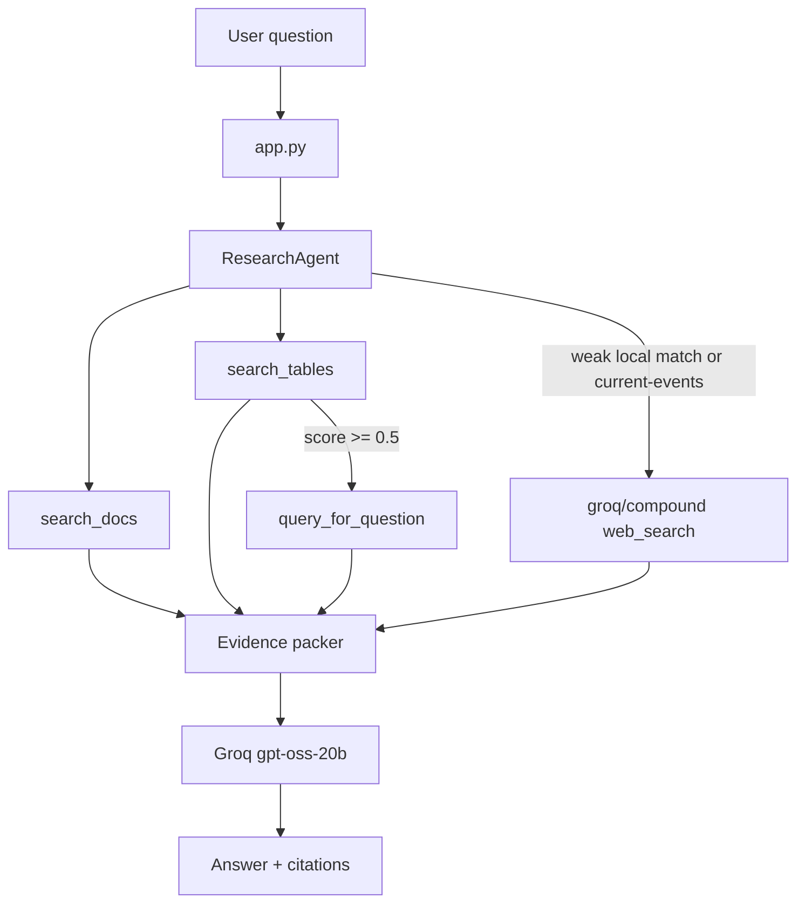
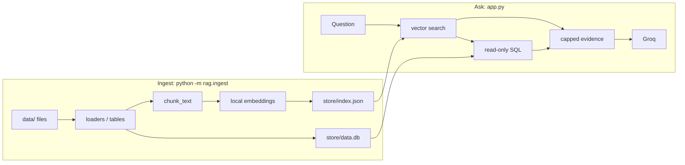

# Architecture

This project is a **multi-source RAG agent**: retrieve evidence from local documents, structured tables, and the web, then generate an answer with citations.

Embeddings are local (`fastembed` / `BAAI/bge-small-en-v1.5`). Generation is Groq (`openai/gpt-oss-20b` for answers and SQL, `groq/compound` for web search).

## System diagram



## Ingest vs ask

Ingest is offline. Ask is online. The model never reads a whole PDF or spreadsheet at question time.



## Sources

| Source | Files | Retrieve | Cite |
| --- | --- | --- | --- |
| Documents | `.txt` `.md` `.pdf` | Chunk + cosine search | file / page |
| Tables | `.csv` `.xlsx` | Schema cards in the index, then SQLite `SELECT` | table name + SQL |
| SQLite | `.db` `.sqlite` | Same as tables | table name + SQL |
| Web | live | Groq Compound `web_search` when local evidence is weak or the question looks current | URL |

Unlabeled or missing sources are not treated as “false”. If docs do not answer, the agent can search the web or say unknown.

## Repository layout

```
app.py                 CLI
agent/
  llm.py               Groq client, models, citation helpers
  research.py          Orchestrator: retrieve, SQL, web, generate
rag/
  ingest.py            Build index + SQLite warehouse
  loaders.py           PDF / text loaders
  chunk.py             Paragraph packing
  embeddings.py        Local embedding model
  store.py             index.json + cosine similarity
  tables.py            CSV / Excel / SQLite import
  sql.py               Read-only SELECT generation and execution
  retrieve.py          search_docs / search_tables
tools/                 Thin wrappers over rag retrieve/SQL
data/                  User corpus (sample notes, CSV, SQLite)
store/                 Generated; gitignored
```

## Ask-time flow

1. Embed the question and retrieve top document chunks.
2. Retrieve table schema cards. If similarity is high enough, Groq writes a `SELECT`/`WITH` query (no writes, no multiple statements, row cap).
3. If the question looks time-sensitive or local scores are low, call `groq/compound` with only the question (small payload).
4. Pack evidence under a character budget and send it to `openai/gpt-oss-20b`.
5. Keep the last four short Q&A turns, not previous evidence dumps.
6. Print answer plus `[doc]`, `[table]`, `[sql]`, `[web]` sources.

## Safety

- `.env` is gitignored. Only `.env.example` is committed.
- SQL allows `SELECT` / `WITH` only.
- The SQLite warehouse is opened read-only at query time.
- Prompt size is capped to stay under Groq request limits.

## Models

| Role | Default |
| --- | --- |
| Answer | `openai/gpt-oss-20b` |
| SQL writer | `openai/gpt-oss-20b` |
| Web search | `groq/compound` |
| Embeddings | `BAAI/bge-small-en-v1.5` (local) |

Override from `.env` with `GROQ_MODEL`, `GROQ_SQL_MODEL`, or `GROQ_COMPOUND_MODEL` if those models are enabled on the Groq key.
